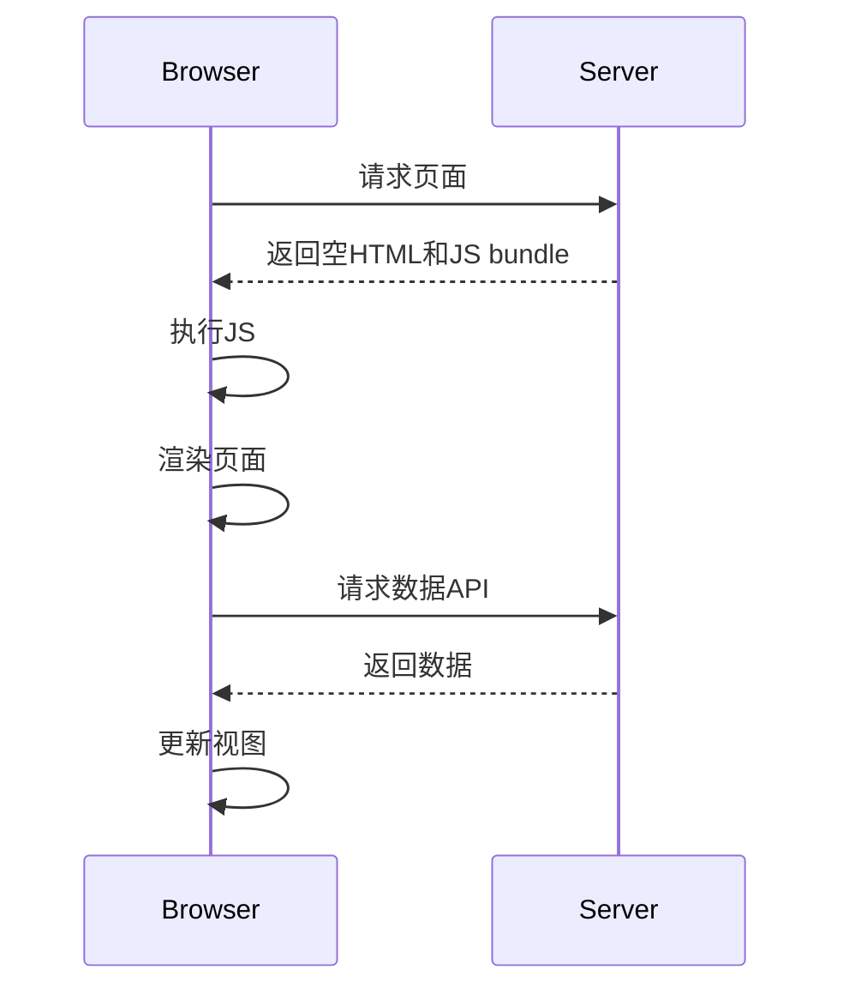
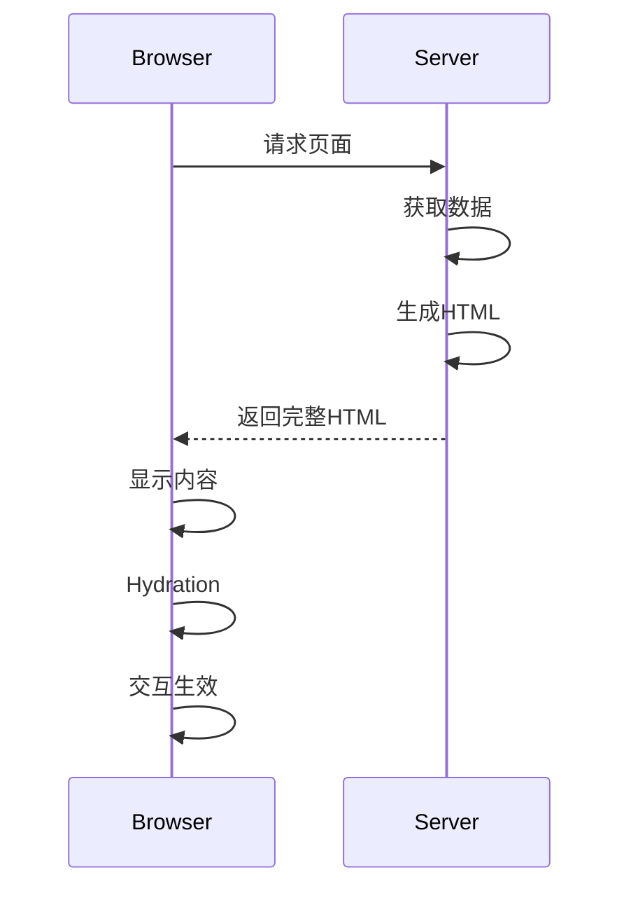
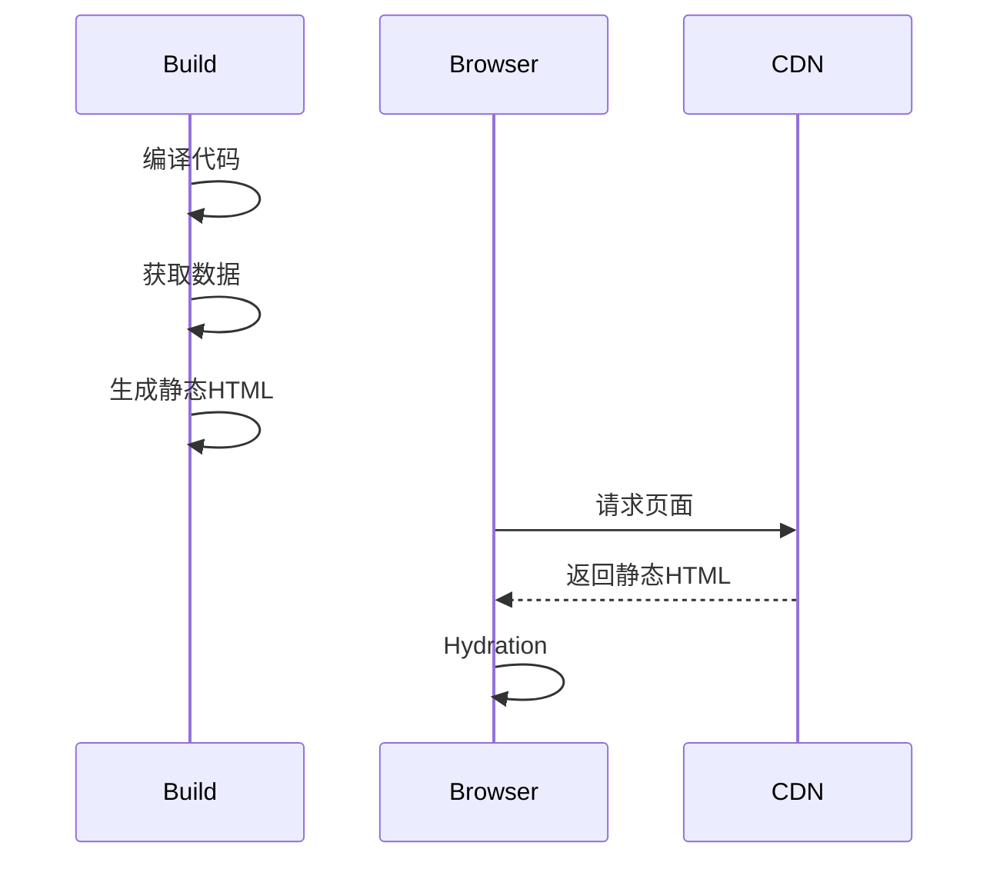
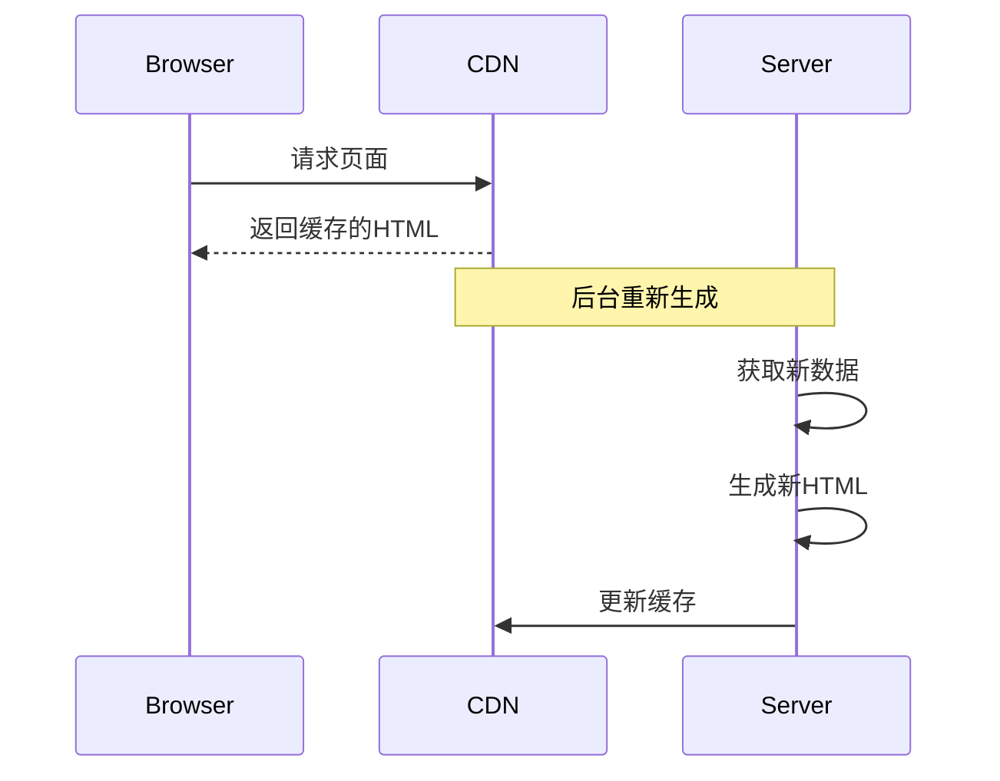
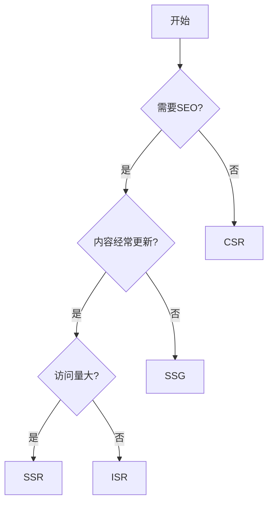

# Web 应用渲染策略

## 1 渲染方式概览

### 1.1 主要渲染策略对比

| 渲染方式 | 执行时机 | SEO | 首屏性能 | 服务器负载 | 适用场景 |
|---------|---------|-----|---------|-----------|---------|
| CSR     | 客户端   | 差  | 较慢     | 低        | 后台管理系统 |
| SSR     | 服务器   | 好  | 快       | 高        | 内容网站 |
| SSG     | 构建时   | 好  | 最快     | 无        | 静态博客 |
| ISR     | 混合     | 好  | 快       | 中        | 新闻网站 |

## 2 CSR (客户端渲染)

### 2.1 工作原理



### 2.2 代码示例

```html
<!-- index.html -->
<!DOCTYPE html>
<html>
<head>
    <title>CSR App</title>
</head>
<body>
    <div id="app"></div>
    <script src="/bundle.js"></script>
</body>
</html>
```

```javascript
// app.js
import { createApp } from 'vue'
import App from './App.vue'

createApp(App).mount('#app')
```

### 2.3 优势

- 前后端完全分离
- 客户端体验好
- 服务器压力小
- 局部更新方便

### 2.4 劣势

- 首屏加载慢
- SEO 不友好
- 白屏时间长
- 对客户端性能要求高

## 3 SSR (服务器端渲染)

### 3.1 工作原理



### 3.2 Nuxt3 实现示例

```typescript
// nuxt.config.ts
export default defineNuxtConfig({
  ssr: true,
  // 自定义 SSR 配置
  nitro: {
    preset: 'node-server',
    timing: true
  }
})
```

```vue
<!-- pages/index.vue -->
<template>
  <div>
    <h1>{{ title }}</h1>
    <ul>
      <li v-for="item in items" :key="item.id">
        {{ item.name }}
      </li>
    </ul>
  </div>
</template>

<script setup>
// 服务端数据获取
const { data: items } = await useFetch('/api/items')
const title = ref('SSR Page')
</script>
```

### 3.3 性能优化

```typescript
// 路由缓存配置
export default defineNuxtConfig({
  routeRules: {
    // 频繁更新的页面禁用缓存
    '/realtime/**': { cache: false },
    // 较少更新的页面启用缓存
    '/blog/**': { cache: true }
  }
})
```

### 3.4 优势

- 更好的 SEO
- 更快的首屏加载
- 更好的低端设备兼容性
- 更好的用户体验

### 3.5 劣势

- 服务器压力大
- 开发复杂度高
- 部署要求高
- 成本较高

## 4 SSG (静态站点生成)

### 4.1 工作原理



### 4.2 Nuxt3 实现示例

```typescript
// nuxt.config.ts
export default defineNuxtConfig({
  nitro: {
    preset: 'static',
    prerender: {
      routes: ['/'],
      crawlLinks: true
    }
  }
})
```

```typescript
// 静态路由生成
export async function getStaticPaths() {
  const posts = await queryPosts()
  
  return posts.map(post => ({
    params: { id: post.id },
    props: { post }
  }))
}
```

### 4.3 优势

- 最快的加载速度
- 最好的 SEO
- 最低的服务器成本
- 最好的安全性

### 4.4 劣势

- 不适合动态内容
- 构建时间长
- 更新不够及时
- 构建服务器要求高

## 5 ISR (增量静态再生成)

### 5.1 工作原理



### 5.2 Nuxt3 实现示例

```typescript
// nuxt.config.ts
export default defineNuxtConfig({
  nitro: {
    routeRules: {
      '/products/**': { 
        isr: true,
        // 缓存时间
        maxAge: 60 * 60 
      }
    }
  }
})
```

```vue
<!-- pages/products/[id].vue -->
<script setup>
definePageMeta({
  // 开启 ISR
  isr: {
    // 每60秒重新生成
    revalidate: 60
  }
})

const { params } = useRoute()
const { data } = await useFetch(`/api/products/${params.id}`)
</script>
```

### 5.3 优势

- 结合了 SSG 和 SSR 的优点
- 良好的性能
- 内容相对新鲜
- 服务器压力适中

### 5.4 劣势

- 配置复杂
- 缓存策略难把控
- 需要额外的存储空间
- 首次生成较慢

## 6 混合渲染

### 6.1 配置示例

```typescript
// nuxt.config.ts
export default defineNuxtConfig({
  routeRules: {
    // 静态页面
    '/': { static: true },
    '/about': { static: true },
    
    // SSR页面
    '/products/**': { ssr: true },
    
    // CSR页面
    '/admin/**': { ssr: false },
    
    // ISR页面
    '/blog/**': { 
      isr: true,
      maxAge: 60 * 60 
    }
  }
})
```

### 6.2 实现策略

```vue
<!-- layouts/default.vue -->
<template>
  <div>
    <!-- 静态头部 -->
    <header>
      <SSROnly>
        <!-- 仅在服务端渲染的内容 -->
      </SSROnly>
    </header>
    
    <!-- 动态内容 -->
    <main>
      <slot />
    </main>
    
    <!-- 客户端渲染的组件 -->
    <ClientOnly>
      <DynamicComponent />
    </ClientOnly>
  </div>
</template>
```

## 7 性能对比

### 7.1 关键指标对比

| 指标 | CSR | SSR | SSG | ISR |
|------|-----|-----|-----|-----|
| TTFB | 慢 | 中等 | 最快 | 快 |
| FCP | 慢 | 快 | 最快 | 快 |
| TTI | 中等 | 慢 | 快 | 快 |
| LCP | 慢 | 快 | 最快 | 快 |

### 7.2 性能优化策略

1. **CSR优化**

   ```javascript
   // 路由级代码分割
   const routes = [
     {
       path: '/admin',
       component: () => import('./views/Admin.vue')
     }
   ]
   ```

2. **SSR优化**

   ```typescript
   // 数据预取
   const prefetchData = () => {
     return Promise.all([
       fetch('/api/data1'),
       fetch('/api/data2')
     ])
   }
   ```

3. **缓存策略**

   ```typescript
   export default defineNuxtConfig({
     nitro: {
       cache: {
         ttl: 60,
         staleWhileRevalidate: true
       }
     }
   })
   ```

## 8 选择建议

### 8.1 场景推荐

1. **使用 CSR 的场景**
   - 后台管理系统
   - 用户仪表盘
   - 实时协作工具
   - 复杂的交互应用

2. **使用 SSR 的场景**
   - 电商网站
   - 新闻门户
   - 社交平台
   - 需要 SEO 的内容网站

3. **使用 SSG 的场景**
   - 博客网站
   - 文档站点
   - 营销页面
   - 公司官网

4. **使用 ISR 的场景**
   - 内容较多的电商网站
   - 大型新闻网站
   - 频繁更新的博客
   - 社区论坛

### 8.2 决策流程图


