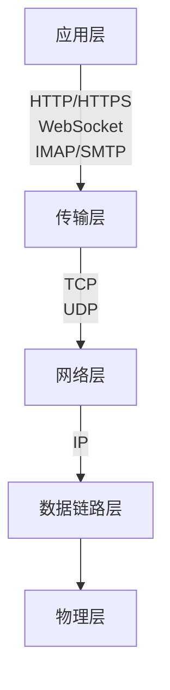
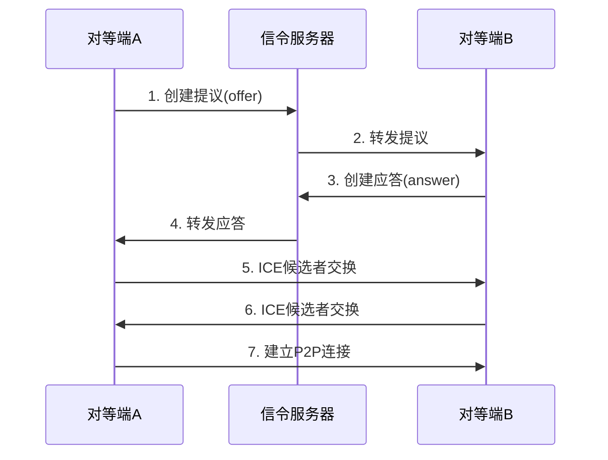

# 网络协议

## 1 网络协议层次结构

网络协议按照OSI模型分层，从上到下依次为：

## 2 Socket套接字

Socket是应用层与TCP/IP协议族通信的中间软件抽象层。

### 2.1 主要特点

- 提供统一的网络编程接口
- 支持多种传输层协议（TCP/UDP）
- 跨平台兼容性好

### 2.2 应用场景

- 网络应用程序开发
- 客户端-服务器架构
- 分布式系统通信

## 3 TCP协议

传输控制协议（Transmission Control Protocol）是一种面向连接的、可靠的、基于字节流的传输层通信协议。

### 3.1 主要特点

- 面向连接
- 可靠传输
- 有序传递
- 流量控制
- 拥塞控制

> [!NOTE] TCP三次握手  
> TCP建立连接需要经过三次握手过程：
>
> 1. 第一次握手（SYN）
>    - 客户端发送SYN包(seq=x)到服务器
>    - 客户端进入SYN_SENT状态
>
> 2. 第二次握手（SYN+ACK）
>    - 服务器收到SYN包
>    - 发送SYN+ACK包(seq=y,ACK=x+1)
>    - 服务器进入SYN_RECV状态
>
> 3. 第三次握手（ACK）
>    - 客户端收到SYN+ACK包
>    - 发送ACK包(ACK=y+1)
>    - 双方进入ESTABLISHED状态
>
> 为什么需要三次握手？
> - 防止旧的重复连接初始化造成混乱
> - 同步双方序列号
> - 确认双方的收发能力

> [!NOTE] TCP四次挥手  
> TCP连接的终止需要经过四次挥手：
>
> 1. 第一次挥手（FIN）
>    - 客户端发送FIN包，停止发送数据
>    - 进入FIN_WAIT_1状态
>
> 2. 第二次挥手（ACK）
>    - 服务器收到FIN包，发送ACK确认
>    - 进入CLOSE_WAIT状态
>    - 客户端收到ACK后进入FIN_WAIT_2状态
>
> 3. 第三次挥手（FIN）
>    - 服务器发送FIN包，停止发送数据
>    - 服务器进入LAST_ACK状态
>
> 4. 第四次挥手（ACK）
>    - 客户端收到FIN包，发送ACK确认
>    - 进入TIME_WAIT状态
>    - 等待2MSL后关闭连接
>
> 为什么需要四次挥手？
> - 确保双方都能够完全关闭连接
> - 防止延迟的数据包被新连接接收
> - TIME_WAIT确保最后的ACK能够到达

## 4 UDP协议

用户数据报协议（User Datagram Protocol）是一种无连接的传输层协议。

### 4.1 主要特点

- 无连接
- 不可靠传输
- 快速传输
- 开销小

### 4.2 应用场景

- 实时游戏
- 视频直播
- DNS查询
- VoIP通话

## 5 IP协议

网际协议（Internet Protocol）是网络层的主要协议。

### 5.1 主要功能

- 网络寻址
- 路由选择
- 分片与重组
- 数据包转发

### 5.2 版本

1. IPv4
   - 32位地址
   - 地址资源有限
   - 广泛使用

2. IPv6
   - 128位地址
   - 更大地址空间
   - 更好的安全性
   - 逐渐普及

## 6 HTTP协议

超文本传输协议（Hypertext Transfer Protocol）是应用层协议。

### 6.1 版本特点

1. HTTP/1.1
   - 持久连接
   - 管道化请求
   - 队头阻塞问题

2. HTTP/2
   - 多路复用
   - 头部压缩
   - 服务器推送
   - 二进制分帧

3. HTTP/3
   - 基于QUIC
   - 改善性能
   - 减少延迟

## 7 WebSocket协议

WebSocket是一种在单个TCP连接上进行全双工通信的协议。

### 7.1 主要特点

- 全双工通信
- 持久连接
- 低延迟
- 支持子协议

### 7.2 应用场景

- 实时聊天
- 在线游戏
- 股票行情
- 实时数据推送

## 8 WebRTC协议

WebRTC (Web Real-Time Communication) 是一种支持网页浏览器进行实时语音对话或视频对话的技术。

### 8.1 核心组件

1. MediaStream (getUserMedia)
   - 访问摄像头和麦克风
   - 捕获屏幕内容
   - 音视频流控制

2. RTCPeerConnection
   - 点对点连接建立
   - NAT穿透
   - 音视频传输
   - 带宽适配

3. RTCDataChannel
   - 点对点数据传输
   - 支持任意数据格式
   - 可选择可靠/不可靠传输

### 8.2 通信流程

> [!NOTE] WebRTC连接建立过程
> 1. 信令阶段
>    - 交换会话描述协议(SDP)
>    - 包含音视频编解码能力
>    - 传输协议选择
>    - 网络信息等
>
> 2. ICE候选者收集
>    - STUN服务器：获取公网IP和端口
>    - TURN服务器：作为中继服务器
>    - 本地候选者收集
>
> 3. 连接建立
>    - ICE优先级排序
>    - 连接性检查
>    - 选择最优路径
>    - 建立P2P通道

### 8.3 主要特点

1. 安全性
   - 强制加密(DTLS/SRTP)
   - 内置安全机制
   - 用户授权机制

2. 网络适应性
   - 自适应比特率
   - 网络质量监测
   - 丢包重传机制

3. 音视频功能
   - 回声消除
   - 噪声抑制
   - 自动增益控制
   - 动态带宽调整

### 8.4 应用场景

1. 音视频通话
   - 视频会议
   - P2P通话
   - 远程教育

2. 实时数据传输
   - 在线游戏
   - 文件传输
   - 远程桌面

3. 直播推流
   - 实时直播
   - 多方互动
   - 在线教学

### 8.5 优势与限制

优势：
- 无需插件
- 点对点通信
- 低延迟
- 安全性高
- 跨平台

限制：
- 浏览器兼容性
- NAT穿透复杂
- 需要信令服务器
- 连接建立时间较长

> [!TIP] WebRTC vs WebSocket
> 1. 通信模式
>    - WebRTC：点对点通信(P2P)
>    - WebSocket：客户端-服务器通信
>
> 2. 应用场景
>    - WebRTC：适合音视频通话、大文件传输
>    - WebSocket：适合消息推送、实时数据更新
>
> 3. 延迟性能
>    - WebRTC：通常延迟更低（P2P直连）
>    - WebSocket：经过服务器转发，延迟相对较高
>
> 4. 实现复杂度
>    - WebRTC：实现复杂，需要额外的信令服务器
>    - WebSocket：实现相对简单

## 9 IMAP协议

互联网邮件访问协议（Internet Message Access Protocol）。

### 9.1 主要功能

- 邮件获取
- 邮件管理
- 邮件同步
- 支持离线操作

## 10 协议对比

### 10.1 TCP vs UDP

| 特性 | TCP | UDP |
|------|-----|-----|
| 连接性 | 面向连接 | 无连接 |
| 可靠性 | 可靠 | 不可靠 |
| 传输速度 | 较慢 | 快速 |
| 使用场景 | 文件传输、网页浏览 | 实时流媒体、游戏 |

### 10.2 HTTP vs WebSocket

| 特性 | HTTP | WebSocket |
|------|------|-----------|
| 通信方式 | 单向 | 双向 |
| 连接特点 | 短连接 | 长连接 |
| 适用场景 | 普通网页请求 | 实时数据传输 |

### 10.3 WebRTC vs 传统流媒体协议

| 特性 | WebRTC | RTMP | HLS |
|------|--------|------|-----|
| 延迟 | 极低 | 低 | 高 |
| 架构 | P2P | C/S | C/S |
| 使用场景 | 实时通话 | 直播推流 | 视频点播 |
| 浏览器支持 | 原生支持 | 需插件 | 原生支持 |

## 11 使用建议

1. 数据可靠性要求高
   - 选择TCP协议
   - 适用于文件传输、电子邮件等

2. 实时性要求高
   - 选择UDP协议
   - 适用于视频直播、在线游戏等

3. 需要双向通信
   - 选择WebSocket
   - 适用于即时通讯、实时数据更新等

4. 普通Web应用
   - 使用HTTP协议
   - 适用于常规网页访问、API调用等

5. 实时音视频通信
   - 选择WebRTC
   - 适用于视频会议、P2P通话等
   - 需要考虑浏览器兼容性
   - 需要配置STUN/TURN服务器

6. 选择流媒体协议时
   - 超低延迟要求：WebRTC
   - 普通直播：RTMP
   - 大规模分发：HLS
